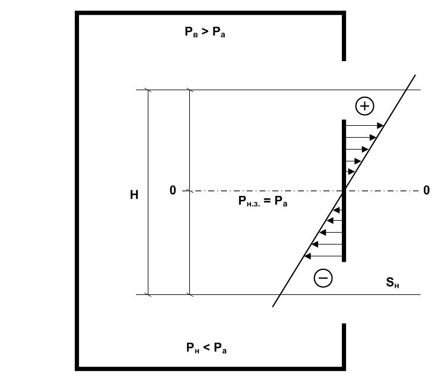
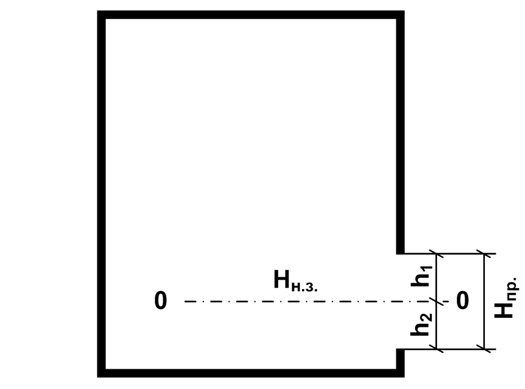

---
output:
  html_document: default
---
# Пожар и его развитие {#pozhar-razvitie}

## Основные понятия и определения

```{definition, echo=TRUE}
***Пожаром** называется неконтролируемое горение, причиняющее материальный ущерб, вред жизни и здоровью граждан, интересам общества и государства* [@pozhbez1994, ст.1].
```

Продолжительность пожара, время воздействия теплоты на окружающую среду, а также материальный ущерб зависят от характера и величины пожарной нагрузки $m_\text{ПН}$ — массы горючих и трудногорючих материалов, в том числе конструктивных элементов, отнесенной к площади пола помещения или площади, занимаемой этими материалами в открытом пространстве ($\text{кг}/\text{м}^2$).

Пространство, в котором развивается пожар, условно подразделяется на три зоны: *горения*, *теплового воздействия* и *задымления*.

Зоной горения называется часть пространства, в котором протекают процессы термического разложения или испарения горючих веществ и материалов (твердых, жидких, газов, паров) в объеме диффузионного факела пламени. Данная зона может ограничиваться ограждениями здания (сооружения), стенками технологических установок, аппаратов, резервуаров.

Зона теплового воздействия примыкает к границам зоны горения. В этой части пространства протекают процессы теплообмена между поверхностью пламени, окружающими строительными конструкциями и горючими материалами. Передача теплоты в окружающую среду осуществляется тремя способами: *конвекцией*, *излучением*, *теплопроводностью.* Границы зоны проходят там, где тепловое воздействие приводит к заметному изменению состояния материалов, конструкций и создает невозможные условия для пребывания людей без противотепловой защиты.

Зоной задымления называется часть пространства, примыкающая к зоне горения и заполненная дымовыми газами в концентрациях, создающих угрозу для жизни и здоровья людей или затрудняющих действия пожарных подразделений. При пожарах в зданиях и на открытых пространствах зоны задымления имеют характерные особенности и зависят от различных факторов. Зона задымления может включать в себя всю зону теплового воздействия и значительно превышать ее. Внешними границами зоны задымления считаются места, где плотность дыма составляет $0,0001\ldots 0,0006$ $\text{кг}/\text{м}^3$ , видимость предметов $6\ldots 12$ м, концентрация кислорода в дыме не менее $16\%$ и токсичность газов не представляет опасности для людей, находящихся без средств противодымной защиты.

В процессе развития пожара различают три характерные фазы. 

- В **первой фазе** горением охватывается до $80\%$ пожарной нагрузки.

- Во **второй фазе** происходит активное пламенное горение с потерей массы пожарной нагрузки, скорость выгорания непрерывно увеличивается и достигает максимальных величин. 

- В **третьей фазе** скорость выгорания резко падает, процесс характеризуется догоранием тлеющих материалов и конструкций.

В каждом конкретном случае процесс развития пожара протекает при определенных условиях сосредоточения или рассредоточения пожарной нагрузки и газообмена, т.е. притока воздуха в зону горения и удаления из нее нагретых продуктов сгорания, а также дымовых газов.

Газовый обмен является постоянным явлением любого пожара. При пожарах на открытом пространстве газообмен характеризуется наличием восходящего столба или движущейся колонны газообразных продуктов сгорания. При пожарах в ограждениях (зданиях) газообмен зависит от наличия, состояния и площади проемов, высоты их расположения, удельной пожарной нагрузки и других факторов. Наиболее интенсивно газообмен протекает при наружных пожарах, пожарах в производственных зданиях со световыми фонарями, бесфонарных зданиях с дымоудаляющими люками в покрытиях, в сценической части и зрительном зале театрально-зрелищных учреждений, зданиях повышенной этажности, особенно административного и гостиничного назначения. Мощные потоки газов, особенно при наружных пожарах, переносят искры, горящие угли и головни на значительные расстояния, создавая условия для возникновения новых очагов горения, что следует учитывать при организации боевых действий подразделений пожарной охраны.

```{r neutralzone1, out.width = "600px", fig.cap = "Подпись к рисунку 1", echo=FALSE}

```


```{r neutralzone2, out.width = "600px", fig.cap = "Подпись к рисунку 2", echo=FALSE}

```


При газообмене в зданиях, когда доступ свежего воздуха к зоне горения сокращается, происходит обильное выделение продуктов неполного сгорания и теплового разложения. Указанные обстоятельства осложняют обстановку, создают наибольшую опасность для жизни людей и затрудняют оперативные действия подразделений по тушению пожара.

При пожарах в зданиях в условиях газообмена образуются три зоны с различными давлениями: нижняя, верхняя и нейтральная (рис. \@ref(fig:neutralzone1)). В нижней зоне (части здания или помещения) давление продуктов сгорания меньше, а в верхней больше давления наружного воздуха. На определенной высоте давление внутри помещения равно атмосферному, т. е. перепад давлений равен $0$. Условная плоскость, на уровне которой давление равно атмосферному (плоскость $0-0$ на рис. \@ref(fig:neutralzone1) и рис. \@ref(fig:neutralzone2)) называется плоскостью равных давлений или нейтральной зоной (см. п. \@ref(upr-gazoobmen)).

## Основные параметры и опасные факторы пожара

Зоны горения, теплового воздействия, задымления характеризуются соответствующими параметрами и опасными факторами, которые в совокупности определяют обстановку на пожаре, учитываются при ее оценке и организации боевых действий подразделения пожарной охраны. Опасными факторами пожара (ОФП) считаются те, воздействия которых приводят к травме, отравлению или гибели людей, а также к материальному ущербу. Перечень основных параметров пожара, ОФП, формулы для определения, а также справочные данные, полученные расчетами, экспериментально и путем анализа потушенных пожаров приведены 8 табл. 1 1—1.16.

## Управление газообменом при тушении пожаров в зданиях {#upr-gazoobmen}

Управление газовым обменом в условиях тушения пожара является важным оперативно-тактическим действием. Например, чем ниже располагается плоскость равных давлений (нейтральная зона), тем больший объем займет зона задымления, возникнет наибольшая вероятность задымления смежных помещений и распространения пожара в них через существующие проемы. Обстановка на пожаре в таких условиях существенно усложняется, опасность для жизни людей возрастает и сковываются боевые действия подразделений пожарной охраны.

Поднятие нейтральной зоны выше приточных проемов предотвращает распространение продуктов сгорания, дыма и пожара в смежные помещения, снижает опасность для жизни людей, создает более благоприятные условия для осуществления боевых действий по тушению пожара. Изменением направления движения газообразных масс обеспечивается безопасность людей, находящихся в здании, создаются необходимые условия для эвакуации или спасения, сдерживания скорости распространения горения, защиты негорящих помещений и материальных ценностей.

В процессе тушения пожаров управление газовым обменом осуществляется путем усиления аэрации вскрытием существующих в здании проемов и ограждающих конструкций; усиления движения газообразных масс с помощью стационарных и передвижных дымоудаляющих установок (дымососов); уменьшения плотности дыма и охлаждения его тонкораспыленной водой с целью осаждения твердых частиц и снижения температуры; вытеснения дыма из помещений пеной средней или высокой кратности; изменения площади приточных я вытяжных проемов, а также их состояния установкой перемычек и герметизацией.

Нейтральная зона располагается ближе к проемам, имеющим большую площадь. Следовательно, в условиях тушения пожара поднятие ее и удаление из помещений дыма осуществляет вскрытием существующих в здании верхних или созданием в ограждающих конструкциях новых проемов. При этом суммарная площадь верхних (вытяжных) проемов должна превышать площадь нижних отверстий, работающих на приток воздуха. Площадь, которую необходимо вскрыть, чтобы поднять нейтральную зону на заданную высоту, аналитически можно определить по формуле п. 8.3 табл. 1.2.

В боевой обстановке увеличение площади верхних проемов путём вскрытия или уменьшения нижних путем их перекрытия производят по визуальному наблюдению поднятия уровня задымления выше нижних проемов (отверстий), через которые осуществляется приток воздуха в помещения и вводятся средства тушения.

Наиболее рациональными соотношениями $S_Н/S_В$ являются: для помещений высотой до $3$ м - $0,4\ldots 0,5$, а для помещений высотой более $3$ м - $0,7\ldots 1,0$. При таких соотношениях суммарных площадей нижних и верхних проемов нейтральная зона будет находиться на уровнях, при которых создаются более благоприятные условия для осуществления боевых действий на пожаре.

Если по обстановке на пожаре требуется ввод сил и средств через дополнительные нижние проемы, необходимо пропорционально увеличить площадь и верхних проемов, через которые удаляются продукты сгорания. В этом случае положение нейтральной зоны не изменится. В помещениях небольшой высоты для поднятия нейтральной зоны и удаления продуктов сгорания вскрывают, как правило, окна. Вскрытие следует производить в верхней части, а не по всей площади окна.

При управлении газообменом большое практическое значение имеет применение дымососов и специальной вентиляции. С помощью этих установок снижаются плотность дыма и концентрация продуктов сгорания (до величин, позволяющих работать в помещении без изолирующих аппаратов); уменьшается температура в помещениях, изменяется направление движения продуктов сгорания, увеличивается видимость и т. д. Дымососы можно устанавливать для удаления продуктов сгорания и подачи воздуха в помещение с одновременным вводом к очагу горения средств тушения.

## Периоды (промежутки) развития пожара

## Формы площади пожара