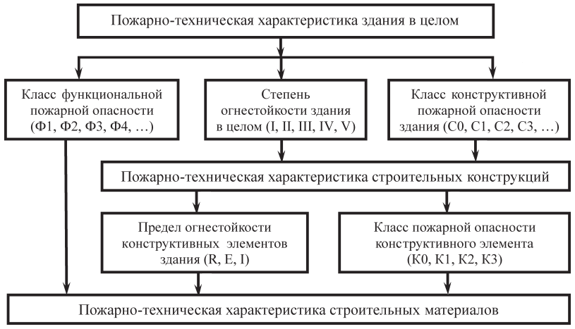

# Пожарная опасность в здании и сооружении {#pozharnaya-opasnost-zdanii-i-sooruzhenii}

## Пожарная опасность веществ и материалов

Классификация строительных, текстильных и кожевенных материалов по пожарной опасности основывается на их свойствах и способности к образованию опасных факторов пожара.

Пожарная опасность строительных, текстильных и кожевенных материалов характеризуется следующими свойствами:

1. горючесть;

2. воспламеняемость;

3. способность распространения пламени по поверхности;

4. дымообразующая способность;

5. токсичность продуктов горения.

По горючести строительные материалы подразделяются на горючие (Г) и негорючие (НГ).

Строительные материалы относятся к негорючим при следующих значениях параметров горючести, определяемых экспериментальным путем: прирост температуры - не более $50$ градусов Цельсия, потеря массы образца - не более $50$ процентов, продолжительность устойчивого пламенного горения - не более $10$ секунд.

Строительные материалы, не удовлетворяющие хотя бы одному из указанных выше значений параметров, относятся к горючим. Горючие строительные материалы подразделяются на следующие группы:

1. слабогорючие (Г1), имеющие температуру дымовых газов не более $135$ градусов Цельсия, степень повреждения по длине испытываемого образца не более $65$ процентов, степень повреждения по массе испытываемого образца не более $20$ процентов, продолжительность самостоятельного горения $0$ секунд;

2. умеренногорючие (Г2), имеющие температуру дымовых газов не более $235$ градусов Цельсия, степень повреждения по длине испытываемого образца не более $85$ процентов, степень повреждения по массе испытываемого образца не более $50$ процентов, продолжительность самостоятельного горения не более $30$ секунд;

3. нормальногорючие (Г3), имеющие температуру дымовых газов не более $450$ градусов Цельсия, степень повреждения по длине испытываемого образца более $85$ процентов, степень повреждения по массе испытываемого образца не более $50$ процентов, продолжительность самостоятельного горения не более $300$ секунд;

4. сильногорючие (Г4), имеющие температуру дымовых газов более $450$ градусов Цельсия, степень повреждения по длине испытываемого образца более $85$ процентов, степень повреждения по массе испытываемого образца более $50$ процентов, продолжительность самостоятельного горения более $300$ секунд.

Для материалов, относящихся к группам горючести Г1 - Г3, не допускается образование горящих капель расплава при испытании (для материалов, относящихся к группам горючести Г1 и Г2, не допускается образование капель расплава). Для негорючих строительных материалов другие показатели пожарной опасности не определяются и не нормируются.

По **воспламеняемости** горючие строительные материалы (в том числе напольные ковровые покрытия) в зависимости от величины критической поверхностной плотности теплового потока подразделяются на следующие группы:

1. трудновоспламеняемые (В1), имеющие величину критической поверхностной плотности теплового потока более $35$ киловатт на квадратный метр;

2. умеренновоспламеняемые (В2), имеющие величину критической поверхностной плотности теплового потока не менее $20$, но не более $35$ киловатт на квадратный метр;

3. легковоспламеняемые (В3), имеющие величину критической поверхностной плотности теплового потока менее $20$ киловатт на квадратный метр.

По **скорости распространения пламени по поверхности** горючие строительные материалы (в том числе напольные ковровые покрытия) в зависимости от величины критической поверхностной плотности теплового потока подразделяются на следующие группы:

1. нераспространяющие (РП1), имеющие величину критической поверхностной плотности теплового потока более $11$ киловатт на квадратный метр;

2. слабораспространяющие (РП2), имеющие величину критической поверхностной плотности теплового потока не менее $8$, но не более $11$ киловатт на квадратный метр;

3. умереннораспространяющие (РП3), имеющие величину критической поверхностной плотности теплового потока не менее $5$, но не более $8$ киловатт на квадратный метр;

4. сильнораспространяющие (РП4), имеющие величину критической поверхностной плотности теплового потока менее $5$ киловатт на квадратный метр.

По **дымообразующей способности** горючие строительные материалы в зависимости от значения коэффициента дымообразования подразделяются на следующие группы:

1. с малой дымообразующей способностью (Д1), имеющие коэффициент дымообразования менее $50$ квадратных метров на килограмм;

2. с умеренной дымообразующей способностью (Д2), имеющие коэффициент дымообразования не менее $50$, но не более $500$ квадратных метров на килограмм;

3. с высокой дымообразующей способностью (Д3), имеющие коэффициент дымообразования более $500$ квадратных метров на килограмм.

По токсичности продуктов горения горючие строительные материалы подразделяются на следующие группы в соответствии с таблицей 2 приложения к ФЗ-123:

1. малоопасные (Т1);

2. умеренноопасные (Т2);

3. высокоопасные (Т3);

4. чрезвычайно опасные (Т4).

Классы пожарной опасности в зависимости от групп пожарной опасности строительных материалов приведены в таблице 3 приложения к ФЗ-123.

Для напольных ковровых покрытий группа горючести не определяется.

Текстильные и кожевенные материалы по воспламеняемости подразделяются на легковоспламеняемые и трудновоспламеняемые. Ткань (нетканое полотно) классифицируется как легковоспламеняемый материал, если при испытаниях выполняются следующие условия:

1. время пламенного горения любого из образцов, испытанных при зажигании с поверхности, составляет более $5$ секунд;

2. любой из образцов, испытанных при зажигании с поверхности, прогорает до одной из его кромок;

3. хлопчатобумажная вата загорается под любым из испытываемых образцов;

4. поверхностная вспышка любого из образцов распространяется более чем на $100$ миллиметров от точки зажигания с поверхности или кромки;

5. средняя длина обугливающегося участка любого из образцов, испытанных при воздействии пламени с поверхности или кромки, составляет более $150$ миллиметров.

Для классификации строительных, текстильных и кожевенных материалов следует применять значение индекса распространения пламени (I) - условного безразмерного показателя, характеризующего способность материалов или веществ воспламеняться, распространять пламя по поверхности и выделять тепло. По распространению пламени материалы подразделяются на следующие группы:

1. не распространяющие пламя по поверхности, имеющие индекс распространения пламени $0$;

2. медленно распространяющие пламя по поверхности, имеющие индекс распространения пламени не более $20$;

3. быстро распространяющие пламя по поверхности, имеющие индекс распространения пламени более $20$. Методы испытаний по определению классификационных показателей пожарной опасности строительных, текстильных и кожевенных материалов устанавливаются нормативными документами по пожарной безопасности [@reglament2008, гл.3].

## Пожарная опасность строительных конструкций

Строительные конструкции классифицируются по огнестойкости для установления возможности их применения в зданиях, сооружениях и пожарных отсеках определенной степени огнестойкости или для определения степени огнестойкости зданий, сооружений и пожарных отсеков.

Строительные конструкции классифицируются по пожарной опасности для определения степени участия строительных конструкций в развитии пожара и их способности к образованию опасных факторов пожара.

Строительные конструкции зданий и сооружений в зависимости от их способности сопротивляться воздействию пожара и распространению его опасных факторов в условиях стандартных испытаний подразделяются на строительные конструкции со следующими пределами огнестойкости:

1. ненормируемый;

2. не менее $15$ минут;

3. не менее $30$ минут;

4. не менее $45$ минут;

5. не менее $60$ минут;

6. не менее $90$ минут;

7. не менее $120$ минут;

8. не менее $150$ минут;

9. не менее $180$ минут;

10. не менее $240$ минут;

11. не менее $360$ минут.

Пределы огнестойкости строительных конструкций определяются в условиях стандартных испытаний. Наступление пределов огнестойкости несущих и ограждающих строительных конструкций в условиях стандартных испытаний или в результате расчетов устанавливается по времени достижения одного или последовательно нескольких из следующих признаков предельных состояний:

1. потеря несущей способности (R);

2. потеря целостности (E);

3. потеря теплоизолирующей способности вследствие повышения температуры на необогреваемой поверхности конструкции до предельных значений (I) или достижения предельной величины плотности теплового потока на нормируемом расстоянии от необогреваемой поверхности конструкции (W).

Предел огнестойкости для заполнения проемов в противопожарных преградах наступает при потере целостности (E), теплоизолирующей способности (I), достижении предельной величины плотности теплового потока (W) и (или) дымогазонепроницаемости (S).

Методы определения пределов огнестойкости строительных конструкций и признаков предельных состояний устанавливаются нормативными документами по пожарной безопасности.

Условные обозначения пределов огнестойкости строительных конструкций содержат буквенные обозначения предельного состояния и группы [@reglament2008, ст.35].

Строительные конструкции по пожарной опасности подразделяются на следующие классы:

1. непожароопасные (K0);

2. малопожароопасные (K1);

3. умереннопожароопасные (K2);

4. пожароопасные (K3).

Численные значения критериев отнесения строительных конструкций к определенному классу пожарной опасности определяются в соответствии с методами, установленными нормативными документами по пожарной безопасности [@reglament2008, ст.36].

## Пожарная опасность зданий и сооружений

Все здания и сооружения представляют собой объекты, которые имеют ту или иную степень пожарной опасности в зависимости от их функциональных особенностей. Это значит, что здания и сооружения в подавляющем своем большинстве содержат совокупность условий, способствующих возникновению пожара и определяющих его возможные масштабы и последствия. Поэтому необходимо привести изначально пожароопасные объекты в состояние пожарной безопасности.

Пожарная безопасность объекта должна как исключать возможность возникновения пожара, так и обеспечить безопасность находящихся там людей в случае его возникновения.

Пожарная безопасность должна обеспечиваться на всех этапах существования объекта: строительстве, эксплуатации, реконструкции, ремонте или аварийной ситуации следующими мерами: объемно-планировочными, конструктивными, инженерно-системными и организационно-техническими решениями.

В зависимости от назначения здания совокупность этих мер может быть различной, так как различными являются условия, в которых необходимо обеспечить эту пожарную безопасность. На обеспечение пожарной безопасности архитектурного объекта влияют два вида факторов: функциональная пожарная безопасность и конструктивная пожарная безопасность.

Функциональная пожарная безопасность является основой, определяющей выбор остальной противопожарной защиты. Ведь в зависимости от способа использования архитектурных объектов и от степени безопасности находящихся в них людей, с учетом возраста, физического состояния, возможности пребывания в состоянии сна, вида основного функционального контингента и его количества, к объектам применяются различные требования. Функциональная пожарная безопасность характеризуется классом функциональной пожарной опасности.


```{r mypic, out.width = "800px", fig.cap = "Подпись к рисунку", echo=FALSE}

```


Конструктивной пожарной безопасности отведена практически определяющая роль. Именно посредством конструктивных решений зданий (элементов несущего остова и ограждающих конструкций) обеспечивается возможность предотвращения распространения пожара, ограничения распространения опасных факторов пожара по помещениям, между помещениями, между этажами и пожарными отсеками. Конструктивная пожарная безопасность характеризуется степенью огнестойкости здания в целом и классом его конструктивной пожарной опасности.

Основные факторы, определяющие при проектировании пожарную безопасность архитектурных объектов:

- Класс функциональной пожарной опасности

- Степень огнестойкости здания

- Класс конструктивной пожарной опасности

### Класс функциональной пожарной опасности

Класс функциональной пожарной опасности определяет безопасность нахождения людей в здании в случае возникновения в этом здании пожара.

Классы функциональной пожарной опасности (Ф1, Ф2, ФЗ, Ф4, Ф5) определяются но Федеральному закону №123-ФЗ «Технический регламент о требованиях пожарной безопасности» и по СНиП 21-01-97 «Пожарная безопасность зданий и сооружений» в зависимости от назначения объекга. По функциональной пожарной опасности все здания подразделяют на следующие классы:

Ф1: Здания для постоянного проживания и временного пребывания людей.

Ф1.1: Детские дошкольные учреждения, специализированные дома престарелых и инвалидов, больницы, спальные корпуса школ-интернатов и детских учреждений.

Ф1.2: Гостиницы, общежития, спальные корпуса санаториев и домов отдыха общего типа, кемпингов, мотелей и пансионатов.

Ф1.3: Многоквартирные жилые дома.

Ф1.4: Одноквартирные, в том числе блокированные жилые дома.

Ф2: Зрелищные и культурно-просветительные учреждения.

Ф2.1: Театры, кинотеатры, концертные залы, клубы, цирки, спортивные сооружения с трибунами, библиотеки и другие учреждения с расчетным числом посадочных мест для посетителей в закрытых помещениях.

Ф2.2: Музеи, выставки, танцевальные залы и другие подобные учреждения в закрытых залах.

Ф2.3: Учреждения, указанные в Ф2.1, на открытом воздухе.

Ф2.4: Учреждения, указанные в Ф2.2, на открытом воздухе.

ФЗ: Предприятия по обслуживанию населения.

Ф3.1: Предприятия торговли.

Ф3.2: Предприятия общественного питания.

ФЗ.З: Вокзалы.

Ф3.4: Поликлиники и амбулатории.

Ф3.5: Помещения для посетителей предприятий бытового и коммунального обслуживания с нерасчетным числом посадочных мест для посетителей.

Ф3.6: Физкультурно-оздоровительные комплексы и спортивно-тренировочные учреждения без трибун для зрителей, бытовые помещения, бани.

Ф4: Учебные заведения, научные и проектные организации, учреждения управления.

Ф4.1: Школы, внешкольные учебные заведения, средние специальные учебные заведения, профессионально-технические училища.

Ф4.2: Высшие учебные заведения, учреждения повышения квалификации.

Ф4.3: Учреждения органов управления, проектно-конструкторские организации, информационные и редакционно-издательские организации, научно-исследовательтельские организации, банки, конторы, офисы.

Ф4.4: Пожарные депо.

Ф5: Производственные и складские здания, сооружения и помещения.

Ф5.1: Производственные здания и сооружения, производственные и лабораторные помещения, мастерские.

Ф5.2: Складские здания и сооружения, стоянки для автомобилей без технического обслуживания и ремонта, книгохранилища, архивы, складские помещения.

Ф5.3: Сельскохозяйственные здания.

Класс функциональной пожарной опасности определяет в первую очередь объемно-планировочные требования к объекту с позиций его пожарной безопасности. Для каждого из этих классов нормируются:

- площадь пожарного отсека;

- высота здания;

- количество и расположение эвакуационных выходов;

- максимальная длина и минимальная ширина путей эвакуации;

- тип и количество лестничных клеток;

- размеры эвакуационных выходов;

- вводятся ограничения на размещение помещений различного назначения в пределах объекта.

Кроме того, класс функциональной пожарной опасности влияет на выбор других составляющих пожарной безопасности объекта: степени огнестойкости архитектурного объекта в целом и его класса конструктивной пожарной опасности [@reglament2008, ст.32].

### Степень огнестойкости здания в целом

Степень огнестойкости здания в целом является исходной характеристикой для проектирования всей конструктивной противопожарной защиты здания. Степень огнестойкости здания в целом определяет требуемые (нормативные) пределы огнестойкости отдельных конструктивных элементов этого здания.

Фактическая степень огнестойкости здания в целом определяется фактическими пределами огнестойкости принятых в проектном решении конструкций и должна быть не менее требуемой [@reglament2008, ст.30].

```{r tablica1, echo=FALSE}

table_head <- c("Степень огнестойкости зданий, сооружений и пожарных отсеков",	
"Несущие стены, колонны и другие несущие элементы",	
"Наружные ненесущие стены",	
"Перекрытия междуэтажные (в том числе чердачные и над подвалами)",
"Строительные конструкции бесчердачных покрытий
\n
---
\n
настилы (в том числе с утеплителем)",
"Строительные конструкции бесчердачных покрытий
\n
---
\n
фермы, балки, прогоны",
"Строительные конструкции лестничных клеток
\n
---
\n
внутренние стены",
"Строительные конструкции лестничных клеток
\n
---
\n
марши и площадки лестниц")

row_1 <- c("I",	"R 120",	"E 30",	"REI 60",	"RE 30",	"R 30",	"REI 120",	"R 60")
row_2 <- c("II",	"R 90",	"E 15",	"REI 45",	"RE 15",	"R 15",	"REI 90",	"R 60")
row_3 <- c("III",	"R 45",	"E 15",	"REI 45",	"RE 15",	"R 15",	"REI 60",	"R 45")
row_4 <- c("IV",	"R 15",	"E 15",	"REI 15",	"RE 15",	"R 15",	"REI 45",	"R 15")
row_5 <- c("V",	"не нормируется",	
           "не нормируется",	
           "не нормируется",	
           "не нормируется",	
           "не нормируется",	
           "не нормируется",	
           "не нормируется")

table_data <- data.frame(table_head, row_1, row_2, row_3, row_4, row_5)
names(table_data) <- NULL
table_data <- t(table_data)

library(janitor)
table_data <- table_data %>%
  row_to_names(row_number = 1)

# header.true <- function(df) {
#   names(df) <- as.character(unlist(df[1,]))
#   df[-1,]
# }
# header.true(table_data)

knitr::kable(
  table_data, booktabs = TRUE,
  caption = 'Подпись к таблице'
) %>%
  kable_styling(bootstrap_options = c("striped", "hover")) %>%
    scroll_box(width = "100%")

# DT::datatable(
#   table_data, extensions = 'FixedColumns',
#   options = list(
#     dom = 't',
#     scrollX = TRUE,
#     fixedColumns = F
#   )
# )
```

### Класс конструктивной пожарной опасности

Класс конструктивной пожарной опасности архитектурного объекта (обозначается СО, Cl, С2, СЗ по Федеральному закону №123-ФЗ «Технический регламент о требованиях пожарной безопасности» и по СНиП 21-01-97 «Пожарная безопасность зданий и сооружений») определяется степенью участия строительных конструкций в развитии пожара и образовании его опасных факторов, так как разные строительные конструкции в системе здания по-разному реагируют на пожарную нагрузку: горят, повреждаются от огня, проводят тепло и т. д.

Очень важно знать фактические параметры пределов огнестойкости широкого спектра применяемых в проектных решениях конструктивных элементов разных конструктивно-строительных систем и способы повышения их огнестойкости. Фактические параметры можно почерпнуть из проектной документации или соответствующих пособий по определению пределов огнестойкости.

На месте пожара, когда таких документов нет под рукой РТП приходится оценивать фактические параметры основываясь только лишь на собственном опыте. Поэтому важно, чтобы РТП обладал достаточным опытом в определении пожароопасных свойств строительных конструкций. Так же с учетом этого важную роль приобретают документы предварительного планирования боевых действий по тушению пожаров и в первую очередь карточек и планов тушения пожаров [@reglament2008, ст.31].


```{r tablica2, echo=FALSE}

table_head <-
c("Класс конструктивной пожарной опасности здания",	
"Несущие стержневые элементы (колонны, ригели, фермы)",	
"Наружные стены с внешней стороны",	
"Стены, перегородки, перекрытия и бесчердачные покрытия",	
"Стены лестничных клеток и противопожарные преграды",	
"Марши и площадки лестниц в лестничных клетках")

row_1 <- c("С0",	"К0",	"К0",	"К0",	"К0",	"К0")
row_2 <- c("С1",	"К1",	"К2",	"К1",	"К0",	"К0")
row_3 <- c("С2",	"К3",	"К3",	"К2",	"К1",	"К1")
row_4 <- c("С3",	"не нормируется",	"не нормируется",	"не нормируется",	"К1",	"К3")

table_data <- data.frame(table_head, row_1, row_2, row_3, row_4)
names(table_data) <- NULL
table_data <- t(table_data)

library(janitor)
table_data <- table_data %>%
  row_to_names(row_number = 1)

# header.true <- function(df) {
#   names(df) <- as.character(unlist(df[1,]))
#   df[-1,]
# }
# header.true(table_data)

knitr::kable(
  table_data, booktabs = TRUE,
  caption = 'Подпись к таблице'
) %>%
  kable_styling(bootstrap_options = c("striped", "hover")) %>%
    scroll_box(width = "100%")

# DT::datatable(
#   table_data, extensions = 'FixedColumns',
#   options = list(
#     dom = 't',
#     scrollX = TRUE,
#     fixedColumns = F
#   )
# )
```

### Пожарная опасность производств

Классификация зданий, сооружений и помещений по пожарной и взрывопожарной опасности применяется для установления требований пожарной безопасности, направленных на предотвращение возможности возникновения пожара и обеспечение противопожарной защиты людей и имущества в случае возникновения пожара в зданиях, сооружениях и помещениях.

По пожарной и взрывопожарной опасности помещения производственного и складского назначения независимо от их функционального назначения подразделяются на следующие категории:

1. повышенная взрывопожароопасность (А);

2. взрывопожароопасность (Б);

3. пожароопасность (В1 - В4);

4. умеренная пожароопасность (Г);

5. пониженная пожароопасность (Д).

6. Здания, сооружения и помещения иного назначения разделению на категории не подлежат.

Категории помещений по пожарной и взрывопожарной опасности определяются исходя из вида находящихся в помещениях горючих веществ и материалов, их количества и пожароопасных свойств, а также исходя из объемно-планировочных решений помещений и характеристик проводимых в них технологических процессов.

Определение категорий помещений следует осуществлять путем последовательной проверки принадлежности помещения к категориям от наиболее опасной (А) к наименее опасной (Д).

К категории А относятся помещения, в которых находятся (обращаются) горючие газы, легковоспламеняющиеся жидкости с температурой вспышки не более $28$ градусов Цельсия в таком количестве, что могут образовывать взрывоопасные парогазовоздушные смеси, при воспламенении которых развивается расчетное избыточное давление взрыва в помещении, превышающее $5$ килопаскалей, и (или) вещества и материалы, способные взрываться и гореть при взаимодействии с водой, кислородом воздуха или друг с другом, в таком количестве, что расчетное избыточное давление взрыва в помещении превышает $5$ килопаскалей.

К категории Б относятся помещения, в которых находятся (обращаются) горючие пыли или волокна, легковоспламеняющиеся жидкости с температурой вспышки более $28$ градусов Цельсия, горючие жидкости в таком количестве, что могут образовывать взрывоопасные пылевоздушные или паровоздушные смеси, при воспламенении которых развивается расчетное избыточное давление взрыва в помещении, превышающее $5$ килопаскалей.

К категориям В1 - В4 относятся помещения, в которых находятся (обращаются) горючие и трудногорючие жидкости, твердые горючие и трудногорючие вещества и материалы (в том числе пыли и волокна), вещества и материалы, способные при взаимодействии с водой, кислородом воздуха или друг с другом только гореть, при условии, что помещения, в которых они находятся (обращаются), не относятся к категории А или Б.

Отнесение помещения к категории В1, В2, В3 или В4 осуществляется в зависимости от количества и способа размещения пожарной нагрузки в указанном помещении и его объемно-планировочных характеристик, а также от пожароопасных свойств веществ и материалов, составляющих пожарную нагрузку.

К категории Г относятся помещения, в которых находятся (обращаются) негорючие вещества и материалы в горячем, раскаленном или расплавленном состоянии, процесс обработки которых сопровождается выделением лучистого тепла, искр и пламени, и (или) горючие газы, жидкости и твердые вещества, которые сжигаются или утилизируются в качестве топлива.

К категории Д относятся помещения, в которых находятся (обращаются) негорючие вещества и материалы в холодном состоянии.

Категории зданий и сооружений по пожарной и взрывопожарной опасности определяются исходя из доли и суммированной площади помещений той или иной категории опасности в этом здании, сооружении.

Здание относится к категории А, если в нем суммированная площадь помещений категории А превышает $5$ процентов площади всех помещений или $200$ квадратных метров.

Здание не относится к категории А, если суммированная площадь помещений категории А в здании не превышает $25$ процентов суммированной площади всех размещенных в нем помещений (но не более $1\,000$ квадратных метров) и эти помещения оснащаются установками автоматического пожаротушения.

Здание относится к категории Б, если одновременно выполнены следующие условия: здание не относится к категории А и суммированная площадь помещений категорий А и Б превышает $5$ процентов суммированной площади всех помещений или $200$ квадратных метров.

Здание не относится к категории Б, если суммированная площадь помещений категорий А и Б в здании не превышает $25$ процентов суммированной площади всех размещенных в нем помещений (но не более $1\,000$ квадратных метров) и эти помещения оснащаются установками автоматического пожаротушения.

Здание относится к категории В, если одновременно выполнены следующие условия: здание не относится к категории А или Б и суммированная площадь помещений категорий А, Б, В1, В2 и В3 превышает $5$ процентов ($10$ процентов, если в здании отсутствуют помещения категорий А и Б) суммированной площади всех помещений.

Здание не относится к категории В, если суммированная площадь помещений категорий А, Б, В1, В2 и В3 в здании не превышает $25$ процентов суммированной площади всех размещенных в нем помещений (но не более $3\,500$ квадратных метров) и эти помещения оснащаются установками автоматического пожаротушения.

Здание относится к категории Г, если одновременно выполнены следующие условия: здание не относится к категории А, Б или В и суммированная площадь помещений категорий А, Б, В1, В2, В3 и Г превышает $5$ процентов суммированной площади всех помещений.

Здание не относится к категории Г, если суммированная площадь помещений категорий А, Б, В1, В2, В3 и Г в здании не превышает 25 процентов суммированной площади всех размещенных в нем помещений (но не более $5\,000$ квадратных метров) и помещения категорий А, Б, В1, В2 и В3 оснащаются установками автоматического пожаротушения.

Здание относится к категории Д, если оно не относится к категории А, Б, В или Г.

Методы определения классификационных признаков отнесения зданий и помещений производственного и складского назначения к категориям по пожарной и взрывопожарной опасности устанавливаются нормативными документами по пожарной безопасности.

Категории зданий, сооружений и помещений производственного и складского назначения по пожарной и взрывопожарной опасности указываются в проектной документации на объекты капитального строительства и реконструкции [@reglament2008, ст.27].
